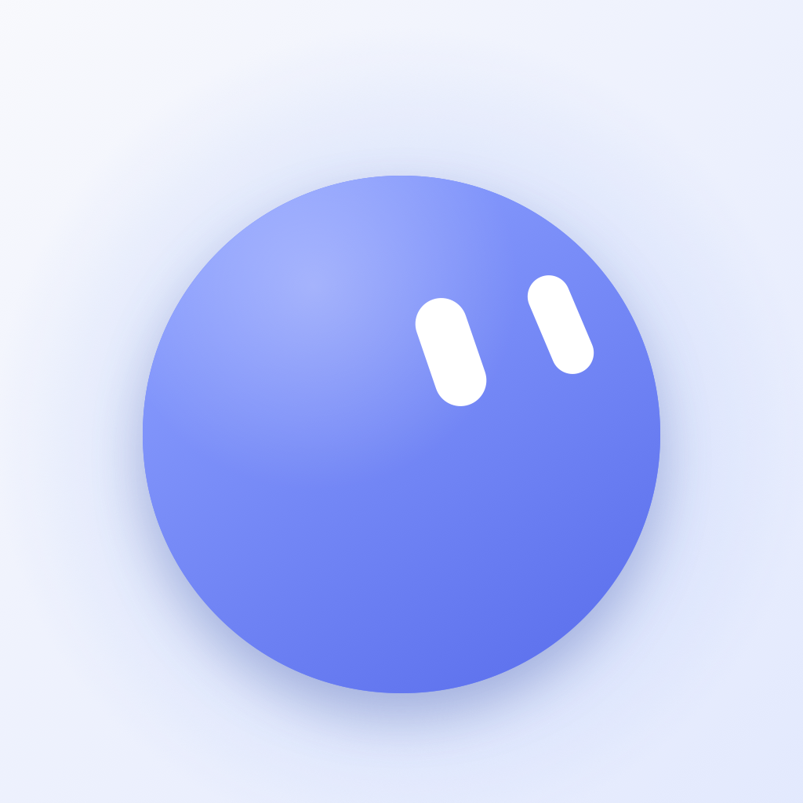

<p align="center"></p>

<h1 align="center">ilo</h1>
<p align="center"><b>Learn anything. Like it's a game.</b><br>Duolingo-style paths for any goal, built live by an AI agent.</p>

---

Type a goal: *"salsa for my grandma's wedding"*, *"code my first website"*, *"Atomic Habits"*. ilo researches it, designs
a path of units and nodes, and generates each lesson on demand from **23 module types**. ilo, an animated mascot with 16
expressions, reacts to every answer along the way.

Built for the **RevenueCat Shipaton 2026 (Next Gen award)**.

## Features
- **AI path builder**: goal → research → units → node briefs. Lessons are generated when you tap a node, and the next
  ones are prefetched.
- **23 lesson modules**:
  - Learn: story cards, audio with karaoke captions, flashcards.
  - Practice: quiz, swipe true/false, match, reorder, word bricks, fill-the-gap, AI-graded free answer, roleplay chat.
  - Real world: photo-proof missions, live code lab (WebKit preview), Vision camera coach, haptic metronome, live voice
    call with ilo.
  - ilo originals: Guess it, Spot the mistake, Sort it, Teach ilo, Speed round, What would you do?, Find it.
- **Game loop**: XP and levels, streaks with freezes, 8 weekly leagues, daily and friend quests, badges, chests, gems.
  Your own mascot is your avatar.
- **Craft**: native Liquid Glass (iOS 26), custom Core Haptics patterns, synthesized sound effects (no audio assets),
  choreographed SwiftUI animations.
- **Monetization with RevenueCat**: a hard paywall after the personalized path reveal, a 7-day trial on the annual plan,
  a weekly anchor plan, restore, and entitlement-gated AI.

## Run it
Requirements: Xcode 26+ (tested on Xcode 27), iOS 26+ simulator or device.

```bash
git clone <this repo> && cd ilo-app
open ilo.xcodeproj   # Run the "ilo" scheme
```

**It runs with zero configuration:**
- Without keys, ilo uses its offline brain: curated flagship courses plus Apple Foundation Models when available.
- Purchases run against the bundled StoreKit configuration (`ilo/Products.storekit`).

### Optional: connect the real services
Copy `ilo/Config.example.plist` to `ilo/Config.plist` (it is git-ignored) and fill in:

| Key | What |
|---|---|
| `SUPABASE_URL`, `SUPABASE_ANON_KEY` | Supabase project hosting the `ilo-ai` edge function + leaderboards |
| `REVENUECAT_API_KEY` | RevenueCat public SDK key (a Test Store `test_…` key works without App Store Connect) |
| `REVENUECAT_ENTITLEMENT` | Entitlement id (default `pro`) |

Backend setup: see [`docs/BACKEND.md`](docs/BACKEND.md). RevenueCat setup: see [`docs/REVENUECAT.md`](docs/REVENUECAT.md).

## Architecture
```
ilo/
  App/            AppModel (state, XP, streaks, quests, persistence), routing
  Bloub/          Mascot engine (64-point morphing silhouettes, 3D eye projection, blinks)
  DesignSystem/   Palette, Liquid Glass components, Haptics (Core Haptics), SoundFX (synth)
  Models/         Course → Unit → PathNode(brief) → Lesson → LessonModule (flat, LLM-friendly)
  Services/       LearningAI protocol, RemoteAI (Supabase → OpenRouter), LocalAI (offline), RevenueCat
  Features/       Onboarding, Paywall, Home, Path, Lesson (+23 modules), Leagues, Quests, Profile, Create
supabase/         Edge function `ilo-ai` + SQL migrations
```

## Credits
Mascot geometry ported from [bloub](https://github.com/jeremy-prt/bloub) (MIT). See `THIRD_PARTY_NOTICES.md`.

## License
MIT. See [LICENSE](LICENSE).
